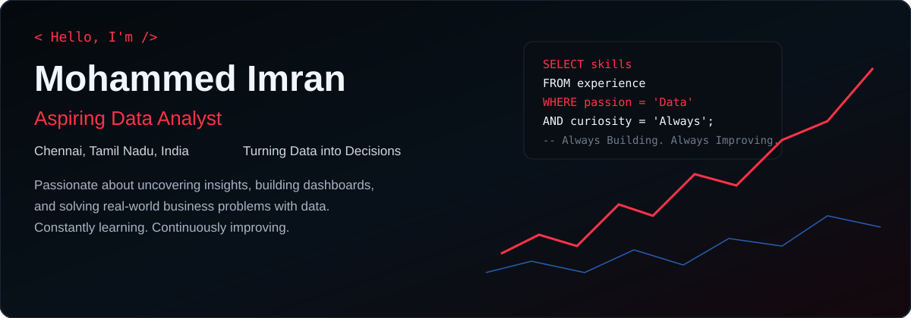
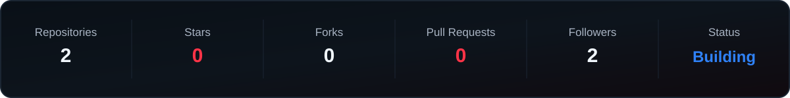
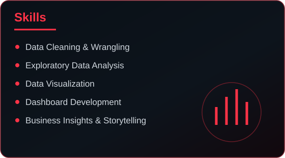
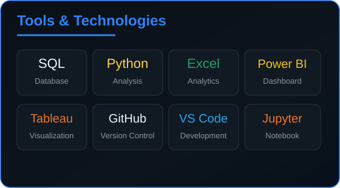
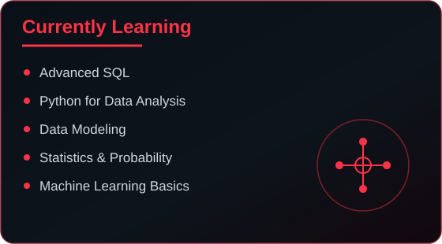
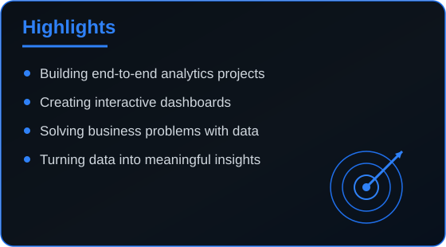
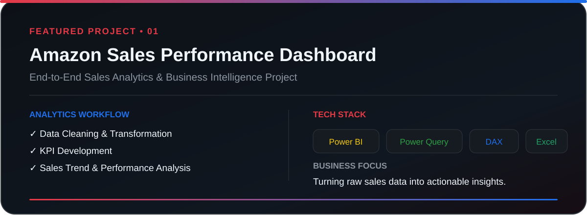

  

 

  

 

<table>
<tr>
<td width="50%" valign="top">

</td>
<td width="50%" valign="top">

</td>
</tr>
</table>

 

  
  

 

## 👨‍💻 About Me

- 📊 Focused on data analysis, business intelligence, and data-driven decision-making
- 🔍 Interested in transforming raw datasets into actionable business insights
- 🧹 Building skills across data cleaning, exploratory analysis, visualization, and reporting
- 🚀 Creating end-to-end portfolio projects using SQL, Power BI, Excel, and Python
  
## 🚀 Featured Projects

 

  

 

### 🛒 E-commerce Sales Analysis — SQL

> A relational e-commerce analytics project built to analyze customers, products, orders, and sales performance using advanced SQL techniques.

**Tech Stack**

`MySQL` `SQL` `CTEs` `Window Functions` `JOINs` `Subqueries`

 

**What I Worked On** 

- Designed and queried a relational e-commerce database
- Analyzed customer and product performance
- Used JOINs to combine related business data
- Applied CTEs and subqueries for complex analysis
- Used Window Functions for ranking and comparative analysis
- Converted raw transactional data into business-oriented insights

 

## 📬 Connect With Me

 

### Thanks for visiting my profile 👋

⭐ Feel free to explore my repositories and follow my data analytics journey.

