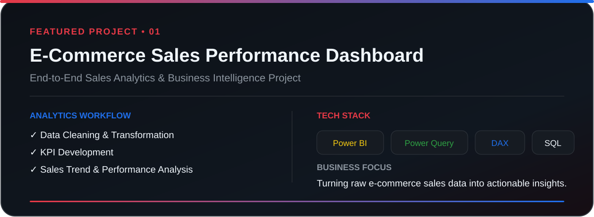
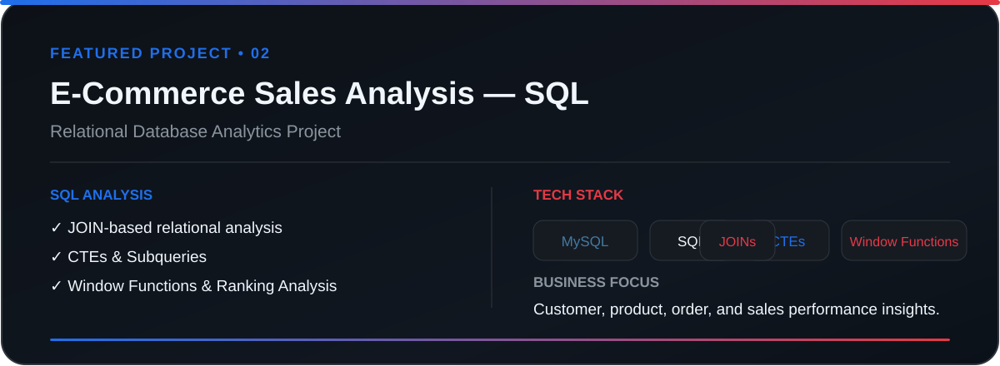
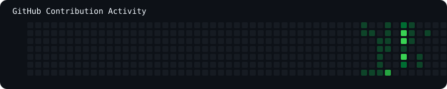

  

 

  

 

<table>
<tr>
<td width="50%" valign="top">

</td>
<td width="50%" valign="top">

</td>
</tr>
</table>

 

  
  

 

## 👨‍💻 About Me

- 📊 Focused on data analysis, business intelligence, and data-driven decision-making
- 🔍 Interested in transforming raw datasets into actionable business insights
- 🧹 Building skills across data cleaning, exploratory analysis, visualization, and reporting
- 🚀 Creating end-to-end portfolio projects using SQL, Power BI, Excel, and Python
  
## 🚀 Featured Projects

 

  

 
 

 

  

 

## 📊 GitHub Activity

  

 

## 📬 Connect With Me

 

### Thanks for visiting my profile 👋

Explore my projects, follow my progress, and connect with me for data analytics opportunities.

